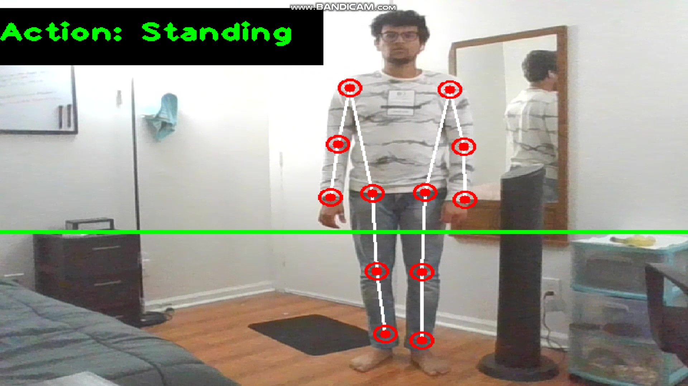
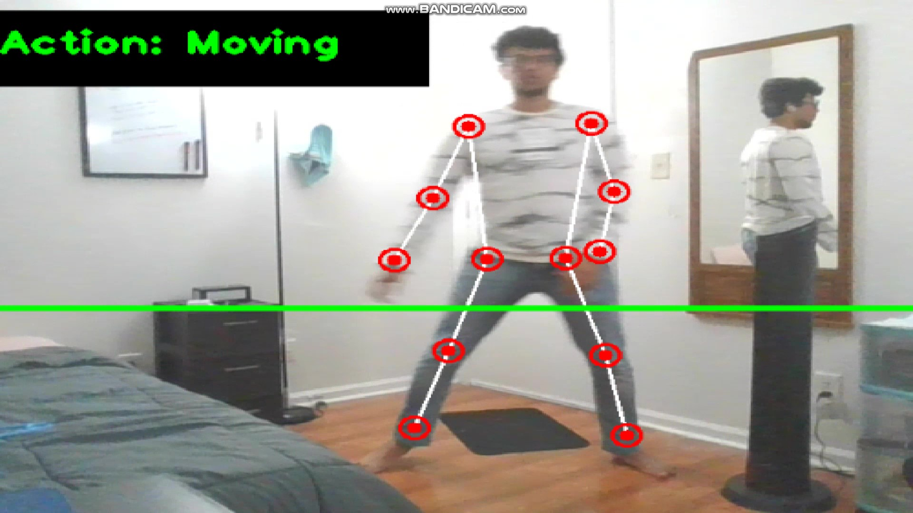
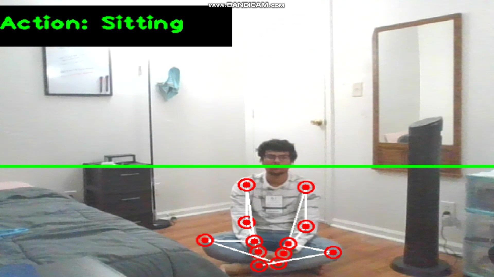

# Human-Activity-Recognition-using-Pose-Estimation

### Introduction:
Developed a Pose Estimation based system which can detect the Activity done by the user. There are 3 activities that were recognised ie Standing, moving and sitting. I used MediaPipe BlazePose to get the keypoint locations from video frames and then based on the coordinates of various bodypart locations between consequtive frames, the person was classified into doing one of the 3 activities. 
Link to MediaPipe BlazePose code used: https://google.github.io/mediapipe/solutions/pose.html

### Implementation:
To check the output of the file, you can simply run the AngleProject.py file. By default it uses webcam to detect pose and activity. If you wish to run it on video file, simply change the "0" in the cv2.VideoCapture line to the file path. 

### Output
We were able to successfully predict 3 actions which were Standing, Moving and Sleeping. 

#### Standing

#### Moving

#### Sleeping/Sitting

